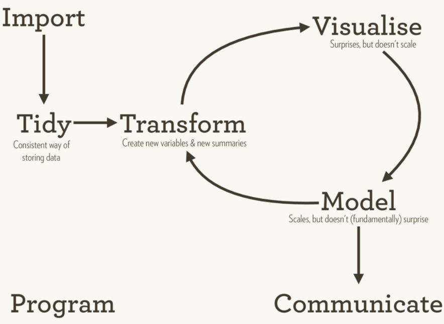
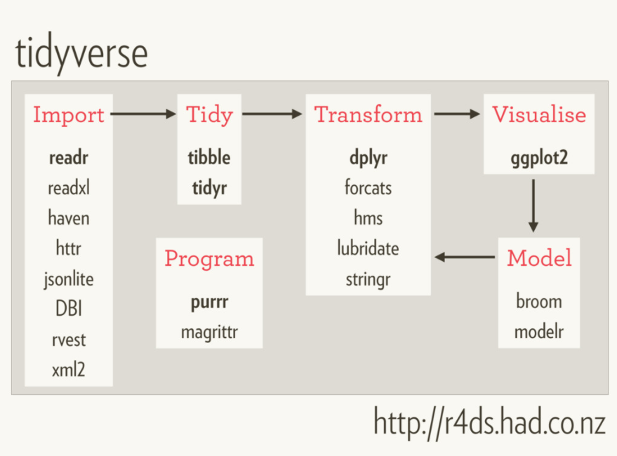
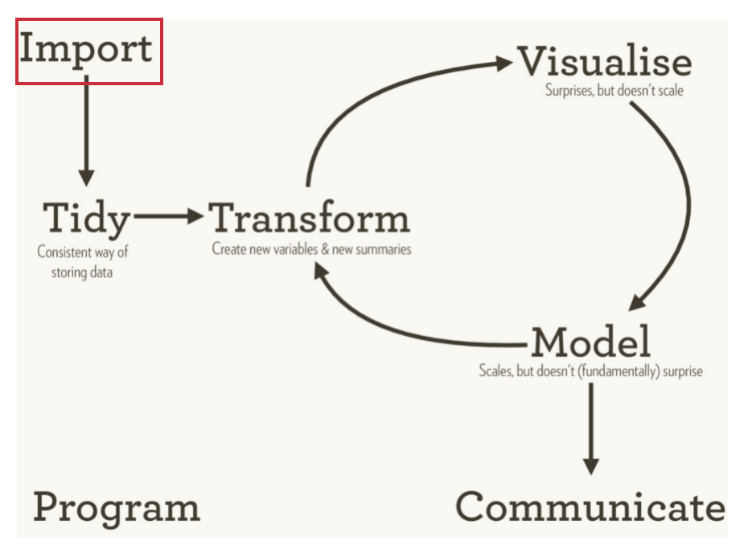
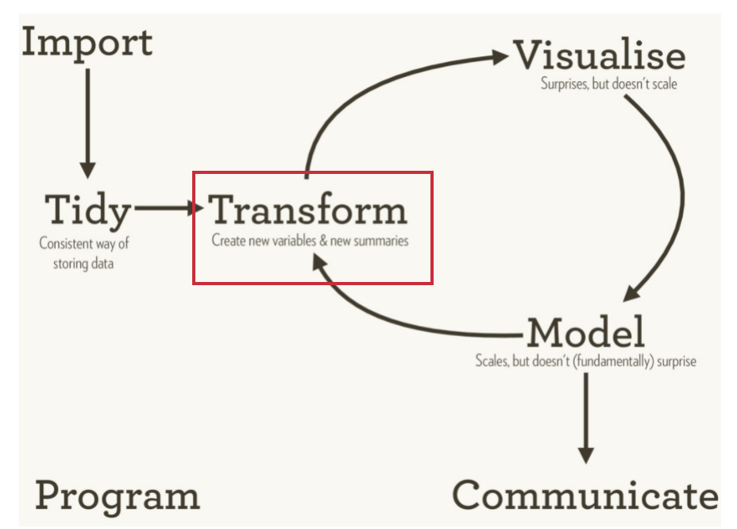
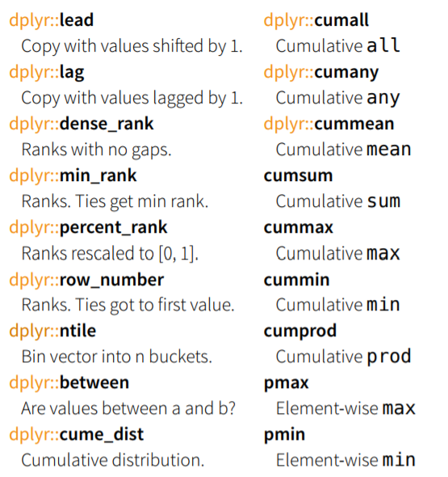
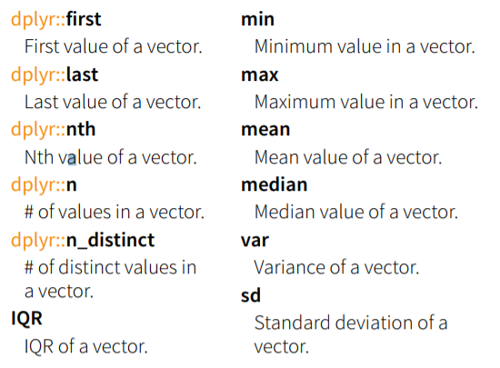
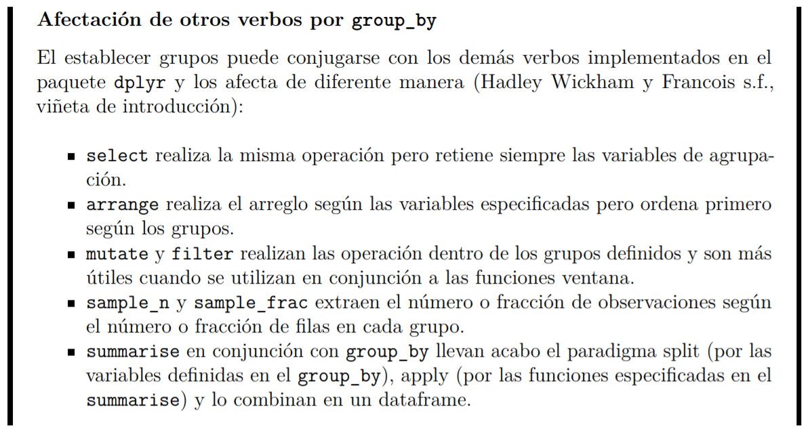
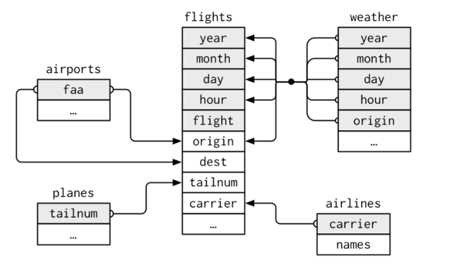
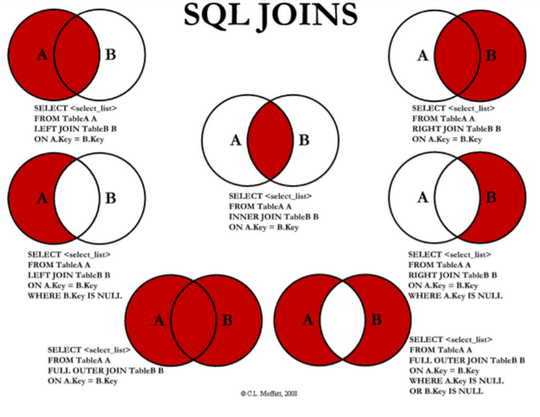
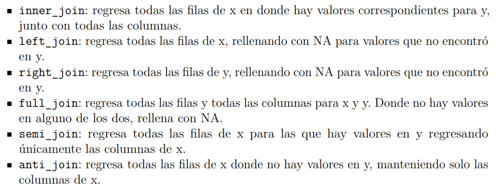

```{r setup, include=FALSE}
knitr::opts_chunk$set(echo = T, warning = F, error = F, message = F)
library(readxl)
library(tidyverse)
```

## El Tidyverse

- Colección de paquetes de `R` diseñado para ciencia de datos.
- Todos los paquetes comparten la misma filosofía de diseño, gramática y estructuras de datos.
- Para tener la instalación completa: 

```{r, eval = F}
install.packages("tidyverse") # colección de paquetes

# Instalen tambien
install.packages("vcdExtra") # Provee de datasets, métodos y documentación adicionales
install.packages("nycflights13") # Provee los datos que usaremos en ejemplos y ejercicios
```

## El ciclo de análisis de datos

Wickham, H y Grolemund G. [*R for Data Science*](http://r4ds.had.co.nz/explore-intro.html)



## El ciclo en paquetes



## Importación



Paquetes útiles:

* readr
* readxl
* haven
* httr
* jsonlite
* DBI
* rvest
* xml2

| Formato                 | Lectura                 | Escritura               |
|-------------------------|-------------------------|-------------------------|
| rds                     | base::readRDS | base::saveRDS |
| separado por \*         | **readr::read_delim** |  **readr::write_delim** |
| csv                     | **readr::read_csv** | **readr::write_csv** |
| Microsoft Excel         | **readxl::read\_excel** | xlsx::write.xlsx |
| dbf                     | foreign::read.dbf  | foreign::write.dbf    |
| IBM SPSS                | **haven::read\_sav** | **haven::write\_sav** |
| Stata                   | **haven::read\_dta** | foreign::write.dta |
| SAS                     | **haven::read\_sas** | **haven::write\_sas** |
| Google spreadsheet      | googlesheets::gs\_read | googlesheets::gs\_new |
| Google bigquery         | bigrquery::query\_exec |                                       |

- En **negritas** funciones del tidyverse.

Los paquetes utilizados son (corre estos comandos en la consola):

```{r}
library(foreign)
library(haven)
library(readr)
library(readxl)
library(googlesheets)
library(bigrquery)
```

**Importancia de rutas relativas**

El comando `getwd()` regresa el directorio al cual `R` esta dirigido en este momento. 

Una buena practica es considerar  el directorio de trabajo como el lugar en donde esta guardado el archivo o `script` en el que se trabaja y "moverse" desde ahí hasta el archivo que se quiere leer.

```{r}
getwd()
```

Y para moverse *una carpeta arriba", se utiliza `..` (es recurrente: `../../../`.

Para moverse hacia adentro de la carpeta se escribe el nombre de la carpeta o archivo: `img/unaimagen.png`


**Algunos ejemplos**

**psv, tsv, etc**

`readr::write_delim`

```{r}
misdatos <- mtcars
write_delim(misdatos, path = "misdatos.psv", delim = "|")
```

```{r}
misdatos <- read_delim(file = "misdatos.psv", delim = "|")
# Los borramos
file.remove("misdatos.psv")
```

**csv**

`readr::write_csv`

```{r}
# readr
write_csv(misdatos, path = "../misdatos.csv", na = "NA", append = FALSE)
```

Observa en el explorador de archivos en dónde es que se guardó el archivo
`misdatos.csv`.

Para **leerlos**, seguimos usando rutas relativas.

```{r}
# readr - como tibble
misdatos <- read_csv("../misdatos.csv")

# Lo borro
file.remove("../misdatos.csv")
```

**SPSS**

`haven::write_sav`

Para **escribirlos**

```{r}
# haven
write_sav(data = misdatos, path = "misdatos.sav")
```

Para **leerlos**

```{r}
# haven - como tibble
misdatos <- read_sav(file = "misdatos.sav", user_na = FALSE)

# Lo borro
file.remove("misdatos.sav")
```

**Stata**

`haven::read_dta`

Para **escribirlos** en `Stata` primero tenemos que cambiar los nombres
de las variables en el *data frame* pues `Stata` no admite puntos en los nombres:

```{r}
names(misdatos) <- tolower(gsub("\\.", "_", names(misdatos)))
# foreign
write.dta(data = misdatos, file = "~/misdatos.dta", version = 12)
```

Para **leerlos**

```{r}
# haven - como tibble
misdatos <- read_dta(file = "~/misdatos.dta", encoding = NULL)

# Lo borramos
file.remove("~/misdatos.dta")
```


**Google Spreadsheet**

Para hacer este ejercicio, debes tener una cuenta de `gmail`.

Primero, debe realizarse la autenticación. Esto lo puedes hacer en cualquier sesión 
interactiva utilizando alguna función del paquete `googlesheets`

```{r, eval = FALSE}
gs_ls()
```

Ahora, vamos a **escribir** una nueva hoja en tu cuenta. 

```{r, eval = F}
gs_new("misdatos", ws_title = "mihoja", input = head(iris)
       , trim = TRUE, verbose = FALSE)
```

De igual forma, puedes ahora **leer** los datos de cualquier 
`google spreadsheet` que tengas en tu cuenta. 

```{r, eval = F}
misdatos <- gs_read(gs_title("misdatos"), ws = "mihoja")
# La borro
gs_delete(gs_title("misdatos"))
```


## Importación / Material adicional

- Libro base de este tutorial https://htmlpreview.github.io/?https://raw.githubusercontent.com/salimv19/ssR/master/aprendeR/importacion-de-datos.html
- Datacamp:
    - https://www.datacamp.com/courses/importing-data-in-r-part-1
    - https://www.datacamp.com/courses/working-with-data-in-the-tidyverse
- Cheatsheet https://www.rstudio.com/resources/cheatsheets/#import

## Transformación



## Los verbos básicos en `dplyr`

```{r accionescomunes, echo=FALSE, results='hold'}
dfTab <- data.frame(
  a <- c("Extracción de **subconjuntos de observaciones**.",
         "Extracción de **subconjuntos de variables**.",
         "Creación de **resumenes de datos**.",
         "Creación de **nuevas variables**.",
         "**Combinación** de conjuntos de datos.",
         "**Agrupar** datos.",
         "**Reorganizar** datos (*reshape data*)."),
  
  b <- c(paste("<span>&#8226;</span> `filter`: seleccionamos filas de acuerdo a los valores de las variables<br>",
         "<span>&#8226;</span>`distinct`: elimina renglones duplicados<br>",
         "<span>&#8226;</span>`sample_frac`: selecciona aleatoriamente una fracción de filas<br>",
         "<span>&#8226;</span>`sample_n`: selecciona aleatoriamente $n$ filas<br>",
         "<span>&#8226;</span>`slice`: selecciona filas por posición<br>",
         "<span>&#8226;</span>`top_n`: selecciona y ordena según una variable $n$ entradas", sep=""),
         "<span>&#8226;</span>`select`: seleccionamos un subconjunto de las columnas utilizando los nombres de las variables",
         paste("<span>&#8226;</span>`summarise`: resume los datos en un valor único<br>",
               "<span>&#8226;</span>`summarise_all`: aplica una función de resumen para todas las columnas<br>",
               "<span>&#8226;</span>`summarise_at`: afecta variables seleccionadas con un vector de caracteres o vars()<br>",
               "<span>&#8226;</span>`summarise_if`: afecta variables seleccionadas con una función predicado<br>",
               "<span>&#8226;</span>`count`: cuenta el número de filas con cada valor única de una variable", sep=""),
         paste("<span>&#8226;</span>`mutate`: genera nuevas variables a partir de las variables originales<br>",
               " <span>&#8226;</span>`mutate_all`: aplica una función ventana a cada columna<br>",
               "<span>&#8226;</span>`transmute`: genera una o más nuevas columnas eliminando las columnas originales", sep=""),
         paste("<span>&#8226;</span>`left_join`: realiza un join conservando todas las observaciones de la primera tabla especificada<br>",
               "<span>&#8226;</span>`right_join`: realiza un join conservando todas las observaciones de la segunda tabla especificada<br>",
               "<span>&#8226;</span>`inner_join`: realiza un join conservando todas las observaciones que están en ambas tablas<br>",
               "<span>&#8226;</span>`full_join`: realiza un join conservando todas las observaciones y valores de ambas tablas<br>",
               "<span>&#8226;</span>`semi_join`: conserva todas las observaciones de la primera tabla que están en la segunda tabla<br>",
               "<span>&#8226;</span>`anti_join`: conserva todas las observaciones de la primera tabla que no están en la segunda tabla<br>",
               "<span>&#8226;</span>`intersect`: conserva observaciones que están tanto en la primera tabla como en la segunda<br>",
               "<span>&#8226;</span>`union`: conserva observaciones que están en cualesquier tabla<br>",
               "<span>&#8226;</span>`setdiff`: conserva observaciones de la primera tabla que no están en la segunda<br>",
               "<span>&#8226;</span>`bind_rows`: une las filas de la segunda tabla a las de la primera<br>",
               "<span>&#8226;</span>`bind_cols`: une las columnas de la segunda tabla a las de la primera", sep=""),
         paste("<span>&#8226;</span>`group_by`: agrupa los datos según una o más variables<br>",
               "<span>&#8226;</span>`ungroup`: elimina los grupos en un data frame", sep=""),
         paste("<span>&#8226;</span>`data_frame`: combina vectores en un dataframe<br>",
               "<span>&#8226;</span>`arrange`: Ordena las filas según una o más variables<br>",
               "<span>&#8226;</span>`rename`: renombra columnas de un dataframe", sep=""))
)
colnames(dfTab) <- c("Acción","Verbos")
knitr::kable(
  dfTab, booktabs = TRUE,
  caption = 'Acciones y verbos comunes en la manipulación de datos [@datawrangling].'
)
```


## Los verbos básicos en acción (saquen su compu)

```{r}
library(nycflights13)
library(vcdExtra)
library(tidyverse)
# Tablas con datos para ejercicios
datasets("nycflights13")

# Tabla para los ejercicios iniciales
flights
```

## filter

```{r}
filter(flights, month == 1, day == 1)
```

 `filter` permite comparaciones (`>, <, ==`), operadores lógicos (`|, &, !, %in%`), preguntar por perdidos (`is.na, is.NaN`)
 
## filter: ejercicios
 
 Encuentra todos los vuelos que:
 
 - Se retrasan más de 2 horas
 - Salen en verano (Junio, Julio, Agosto)
 - Salen en invierno (Diciembre, Enero, Febrero)
 - ¿Son muy diferentes en -volúmen de vuelos- ambas estaciones?
 - ¿Cuántos vuelos tienen valores perdidos en `dep_time`?
 
## filter: ejercicios / respuestas

```{r}
# Se retrasan más de 2 horas
filter(flights, dep_delay > 120)

# Salen en verano (Junio, Julio, Agosto)
filter(flights, month %in% c(6, 7, 8))

# Salen en invierno (Diciembre, Enero, Febrero)
filter(flights, month %in% c(1, 2, 12))

# ¿Son muy diferentes en -volúmen de vuelos- ambas estaciones?
nrow(filter(flights, month %in% c(1, 2, 12)))
nrow(filter(flights, month %in% c(6, 7, 8)))
# R> No

# ¿Cuántos vuelos tienen valores perdidos en `dep_time`?
filter(flights, is.na(dep_time))
```
 
 
## distinct

Para eliminar duplicados, usamos la función `distinct` 

```{r}
flights.dup <- bind_rows(flights, flights)
dim(flights.dup)
dim(distinct(flights.dup))
rm(flights.dup)
```

## sample_n, sample_frac, slice

En ocasiones necesitamos extraer subconjuntos aleatorios de los datos, para ello podemos especificar:

- el número de renglones que necesitamos (usando `sample_n`);
- el porcentaje de datos que deseamos (usando `sample_frac`);
- las posiciones específicas de los datos que queremos (usando `slice`).

```{r}
set.seed(1099) 
# extraemos 10 datos en forma aleatoria
sample_n(flights, size = 10)
# Extraemos el 1% de los datos de flights
sample_frac(flights, size = 0.01)
# extraemos las posiciones 100 a 110
slice(flights, 100:110)
```

## arrange

Arrange te permite ordenar un conjunto de datos según una o más variables en forma ascendente y descendiente.
 
```{r}
arrange(flights, year, month, day)
arrange(flights, desc(arr_delay))
```

## arrange: ejercicios
 
- ¿Cuáles son los vuelos más cortos?
- ¿Cuáles son los más largos?

## arrange: ejercicios / Respuestas

```{r}
# ¿Cuáles son los vuelos más cortos?
arrange(flights, air_time) %>%
  select(origin, dest, distance) %>%
  distinct()

# ¿Cuáles son los más largos?
arrange(flights, desc(air_time)) %>%
  select(origin, dest, distance) %>%
  distinct()

```


## top_n

`dplyr` está lleno de funciones que particularizan a los verbos más sencillos. El ejercicio anterior, lo podemos obtener más fácilmente con la función `top_n`

Por ejemplo, los 5 vuelos con mayor retraso de salida:

```{r}
top_n(flights, 5, dep_delay)
```

O con el menor retraso de salida:

```{r}
top_n(flights, 5, desc(dep_delay))
```

## select

Te permite seleccionar variables de distintas formas.

```{r}
select(flights, year, month, day)
select(flights, year:day)
select(flights, -(year:day))
```

`select` tiene funciones que te permiten aprovecharlo más:

- `starts_with("XXX")` trae todos los nombres que empiezan con "XXX"
- `ends_with("XXX")` trae todos los nombres que terminan con "XXX"
- `contains("XXX")` trae todos los nombres que tiene la cadena de caracteres "XXX"
- `matches("XXX")` trae todos los nombres que continen la cadena de caracteres "XXX"
- `num_range("x", 1:3)` trae "x1, x2, x3"

## select: ejercicios

¿De cuántas maneras puedo llamar a las variables `dep_time`, `dep_delay`, `arr_time`, `arr_delay`?

## select: ejercicios / Respuestas

```{r}
select(flights, dep_time, dep_delay, arr_time, arr_delay)
select(flights, starts_with("dep"), starts_with("arr"))
select(flights, ends_with("delay"), ends_with("time")) # trae cosas de mas
select(flights, matches("^arr_|^dep_"))
```


## mutate

Mutate te permite agregar nuevas variables que suelen ser funciones de otras columnas.

```{r, eval = F}
mutate(flights,
       velocidad = distance / air_time * 60
       )
```

*¿Qué hace esta operación?*

## mutate: ejercicios

1. Utiliza la función `str_sub` dentro de `stringr` para extraer únicamente el 
día del campo `time_hour`.
2. Utiliza la función `ymd` del paquete `lubridate` para declarar time_hour como una
fecha (¡otra clase!).
3. Compara air_time contra (arr_time - dep_time). (Tip: *Usa mutate para crear una variable con la resta, después selecciona las variables a comparar.*)
4. ¿Qué esperabas encontrar?
5. ¿Hay algo que arreglar?
  
## mutate: ejercicios / Respuestas

```{r, cache=T}
# 1 Utiliza la función `str_sub` dentro de `stringr` para extraer únicamente el día del campo `time_hour`
mutate(flights, dia = stringr::str_sub(time_hour, 9, 10)) %>%
    select(time_hour, dia)

# 2 Utiliza la función `ymd` del paquete `lubridate` para declarar time_hour como una fecha (¡otra clase!).
mutate(flights,
       fecha = stringr::str_sub(time_hour, 1, 10)
       , fecha = lubridate::ymd(fecha)) %>%
    select(time_hour, fecha)


# 3 Compara air_time contra (arr_time - dep_time). (Tip: *Usa mutate para crear una variable con la resta, después selecciona las variables a comparar.*)
flights %>%
  select(arr_time, dep_time, air_time) %>%
  na.omit() %>%
  mutate(tiempo = arr_time - dep_time) %>%
  select(air_time, tiempo) -> diferencias

diferencias

ggplot(diferencias, aes(tiempo, air_time)) +
  geom_point()

# 4 ¿Qué esperabas encontrar?
# Tiempos similares, no se estan considerando fecha, horas minutos

# 5 ¿Hay algo que arreglar?
# Del time_hour + dep_delay + air_time

mutate(flights, 
       time_hour_arr = time_hour + lubridate::minutes(dep_delay + air_time),
       tiempo = time_hour_arr - time_hour) %>%
  select(time_hour, time_hour_arr, air_time, tiempo)
```

## mutate en esteroides: funciones ventana

Hay muchas funciones auxiliares dentro de  `dplyr` que te permiten aprovechar más al verbo `mutate`. Por ejemplo, tiene implementado varias funciones ventana:



Estas funciones son mucho más útiles en *grupos* (ahí viene).

Fuente: [Data wrangling cheatsheet](https://www.rstudio.com/wp-content/uploads/2015/02/data-wrangling-cheatsheet.pdf)

## summarise

Permite colapsar un data frame en una única fila "resumen"

```{r}
dplyr::summarise(flights, delay = mean(dep_delay, na.rm = TRUE))
```

## summarise: ejercicio

Utiliza la función `summarise` para calcular la media de las variables `date`, `dep_delay`, `arr_delay`.

## summarise_if

El ejercicio anterior es engorroso. Podemos simplificarlo.

Podemos especificar una función a aplicar a variables específicas en un
dataframe. Por ejemplo, extraer la media para las variables numéricas.

```{r}
summarise_if(flights, is.numeric, mean, na.rm = TRUE)
```

## summarise en esteroides: funciones de agregación

También se encuentran implementadas funciones de agregaciones muy comunes:



Fuente: [Data wrangling cheatsheet](https://www.rstudio.com/wp-content/uploads/2015/02/data-wrangling-cheatsheet.pdf)


## group_by

Igual que `mutate`, `summarise` es mucho más útil si se piensa en el contexto de grupos, para lo que nos sirve la función `group_by`.

```{r}
flights_agrupada <- group_by(flights, year, month, day)
class(flights_agrupada)
flights_agrupada
```

Ahora si, puedo generar resumenes útiles por día. Por ejemplo, el retraso promedio por día:

```{r}
dplyr::summarise(flights_agrupada, delay = mean(dep_delay, na.rm = TRUE))
```

## Los verbos y el group_by




## group_by: ejercicios

- Utiliza la función `top_n`, junto con `group_by`, `arrange` y `summarise` para extraer los 10 aviones por aerolínea con el menor promedio de velocidad.
- ¿Cuáles son los aeropuertos con mayor promedio de retraso en la salida?
- ¿Cuáles son los aeropuertos con mayor promedio de retraso en las llegadas?

## group_by: ejercicios / Respuestas

```{r}
#1
# 10 aviones mas lentos por carrier
mutate(flights, velocidad = distance/air_time) %>%
    group_by(carrier) %>%
    arrange(velocidad) %>%
    top_n(-10) %>%
    select(tailnum, carrier, velocidad) %>%
    ungroup() %>%
    arrange(carrier, velocidad) %>%
    head(20)

#2 aeropuerto con mayor promedio de retraso de salida
group_by(flights, origin) %>%
  dplyr::summarise(dep_delay = mean(dep_delay, na.rm = T)) %>%
  arrange(desc(dep_delay))

#3 aeropuerto con mayor promedio de retraso de llegada
group_by(flights, dest) %>%
  dplyr::summarise(arr_delay = mean(arr_delay, na.rm = T)) %>%
  arrange(desc(arr_delay))
```


## %>%

Un verbo solo no es demasiado útil. Lo poderoso de los verbos es utilizarlos en conjunto. Para ello, ayuda mucho utilizar el operador *pipe*.

Por ejemplo, puedo encontrar los peores días en retrasos.

```{r}
select(flights, 
  year:day, 
  ends_with("delay"), 
  distance, 
  air_time
) %>%
  mutate(
  gain = arr_delay - dep_delay,
  speed = distance / air_time * 60
) %>%
  group_by(year, month, day) %>%
  filter(rank(desc(arr_delay)) < 10)
```

o los destinos más populares

```{r}
flights %>% 
  group_by(dest) %>% 
  filter(n() > 365)
```

## %>%: ejercicios

1. ¿Cuál es la hora óptima para viajar para evitar retrasos?
2. Encuentra todos los destinos que vuelan por más de una aerolínea. ¿Cuál es la mejor aerolínea en ese subgrupo?

## %>%: ejercicios / Respuestas

```{r}
# 1. ¿Cuál es la hora óptima para viajar para evitar retrasos?
flights %>%
  group_by(hour) %>%
  dplyr::summarise(dep_delay = mean(dep_delay, na.rm = T)) %>%
  arrange(dep_delay)

# 2. Encuentra todos los destinos que vuelan por más de una aerolínea. ¿Cuál es la mejor aerolínea en ese subgrupo?
flights %>%
  group_by(dest, carrier) %>%
  dplyr::summarise(
    air_time = mean(air_time, na.rm = T)
  ) %>%
  ungroup() %>%
  group_by(dest) %>%
  mutate(n = n()) %>%
  filter(n > 1) %>%
  arrange(dest, air_time) %>%
  top_n(-1, wt = air_time)

```

## joins: preliminares

- ¿Qué pasa si lo que quiero es saber cómo se ven afectados los retrasos por el clima?
- ¿O como afecta el tipo de avión y su edad a la velocidad promedio?
- ¿O si hay aeropuertos que están muy saturados e, independientemente del clima o el destino, siempre tienen retrasos?

Para ello, debo juntar información de otras de las bases que están en el paquete `nycflights13`.

## joins: preliminares

Recordemos las tablas en el paquete:

```{r}
datasets("nycflights13")
```

El modelo de relación de las tablas se ve como sigue:



## joins: SQL

Podemos pensar en los joins que se realizan en SQL>



## joins: dplyr

Y entender cómo se traducen en dplyr:



## joins: ejemplo sencillo

Ahora, supongamos que queremos saber la velocidad promedio de los aviones que
tenemos en nuestros datos para todos sus vuelos.

```{r}
# base de aviones con velocidad
library(nycflights13)
vel_aviones <- flights %>% 
  group_by(tailnum) %>% # identificador de avion
  dplyr::summarise(vel_prom = mean(distance/air_time, na.rm = T))
  
inner_join(
  planes,
  vel_aviones
)  %>%
  select(tailnum, year, vel_prom) %>%
  arrange(desc(vel_prom))
```

Ahora, queremos saber los destinos con mayores retrasos.

```{r}
destinos <- flights %>% 
  group_by(dest) %>%
  dplyr::summarise(retraso = mean(arr_delay, na.rm = T))

inner_join(
  airports, 
  destinos,
  by = c("faa" = "dest")
) %>%
  arrange(desc(retraso))
```


## joins: ejemplo con graficación

Esto nos permite contestar preguntas aún más poderosas. Por ejemplo, podemos calcular el promedio de retrasos por destinos, juntar esa información con los datos de aeropuertos para dibujar la distribución espacial de los retrasos.

```{r}
airports %>%
  semi_join(flights, c("faa" = "dest")) %>%
  ggplot(aes(lon, lat)) +
    borders("state") +
    geom_point() +
    coord_quickmap()
```

Para más ejemplos como estos, revisa el capítulo de "[Relational data](http://r4ds.had.co.nz/relational-data.html)" en *R for data science*. 

## joins: ejercicios

1. ¿Cuáles son los aeropuertos que SI están en la base de destinos?
2. ¿Cuáles son los aeropuertos que NO están en la base de destinos?
3. Realiza un resumen de los vuelos por aeropuerto para varias variables con la función `summarise`.
4. Utiliza la función `inner_join` para pegar la tablas de resumen creada en el paso anterior a la tabla `airports`
5. Realiza un resumen de los vuelos por avión para varias variables con la función `summarise`.
6. Utiliza la función `left_join` para pegar la tablas de resumen creada en el paso anterior a la tabla `planes`
7. Extrae el porcentaje de vuelos cancelados por aerolínea cada año y el porcentaje de vuelos retrasados por aerolínea cada año.

## joins: ejercicios / Respuestas

```{r}
# 1 ¿Cuáles son los aeropuertos que SI están en la base de destinos?
semi_join(airports, flights, by = c("faa" = "dest"))

# 2 ¿Cuáles son los aeropuertos que NO están en la base de destinos?
anti_join(airports, flights, by = c("faa" = "dest"))

# 3 Realiza un resumen de los vuelos por aeropuerto para varias variables con la función `summarise`.
res.vuelos <- flights %>%
  group_by(dest) %>%
  dplyr::summarise(
    flights = n()
    , planes = n_distinct(tailnum)
    , carriers = n_distinct(carrier)
    , dep_delay_mean = mean(dep_delay, na.rm = T)
  )

# 4 Utiliza la función `inner_join` para pegar la tablas de resumen creada en el paso anterior a la tabla `airports`
airports_flights <- inner_join(airports, res.vuelos
                               , by = c("faa" = "dest"))

# 5 Realiza un resumen de los vuelos por avión para varias variables con la función `summarise`.
res.aviones <- flights %>%
  group_by(tailnum) %>%
  dplyr::summarise(
    flights = n()
    , carriers = n_distinct(carrier)
    , dep_delay_mean = mean(dep_delay, na.rm = T)
    , arr_delay_mean = mean(arr_delay, na.rm = T)
    , dist_mean = mean(distance, na.rm = T)
    , vel_mean = mean(distance/air_time, na.rm = T)
  ) 

# 6 Utiliza la función `left_join` para pegar la tablas de resumen creada en el paso anterior a la tabla `planes`
planes_flights <- left_join(planes, res.aviones)

# 7 Extrae el porcentaje de vuelos cancelados por aerolínea cada año y el porcentaje de vuelos retrasados por aerolínea cada año.
flights %>%
  mutate(
    cancelled = ifelse(is.na(dep_time), T, F),
    anio = lubridate::year(time_hour)) %>%
  group_by(carrier, anio) %>%
  dplyr::summarise(
    vuelos.anuales = n()
    , cancelados = sum(cancelled, na.rm = T)/vuelos.anuales * 100
    , retrasados = sum(dep_delay > 0, na.rm = T)/vuelos.anuales * 100
  ) %>%
  ungroup()
```

## dplyr / material adicional

- Cheatsheet https://www.rstudio.com/resources/cheatsheets/#dplyr
- Libro base de este tutorial: https://htmlpreview.github.io/?https://raw.githubusercontent.com/salimv19/ssR/master/aprendeR/transformacion-de-datos.html
- Curso de swirl Getting and cleaning data.
- Curso Cleaning Data in R de Data Camp.
- Curso Data Manipulation in R with dplyr de Data Camp.
- Curso Joining data in R with dplyr de Data Camp

## Datos limpios


## Datos limpios

Los conjuntos de datos limpios (*tidy datasets*) permiten manipularlos facilmente, modelarlos y visualizarlos.

Los datos limpios tienen una estructura especifica: 

- cada variable es una columna, 
- cada observacion una fila y,
- cada tipo de unidad observacional forma una tabla

En resumen: "cada valor ocupa su propia celda"


## Representaciones de los mismos datos

Pensemos en unos datos:


Su estructura "transpuesta":


Su estructura "tidy" o "limpia":


1. *persona* con tres posibles valores (John, Jane, Mary)
2. *tratamiento* con dos posibles valores (a o b)
3. *resultado* con 6 valores (-, 16, 3, 2, 11, 1)

## Datos limpios: ejercicio

- Crea un dataframe con los valores de la tabla 1 y otro con los valores de la tabla 3.
- Extrae el resultado para (John Smith, tratamiento a) en la primera configuracion y en la segunda.
- Especifica el numero de tratamientos con la forma sucia y la forma limpia.
- ¿Cual es la media de los resultados? Usa la forma 1 y la forma 2.
- Extrae los tratamientos del tipo a en la forma 2.

## Datos limpios: ejercicio 2

Este tipo de formato de datos (poner valores de variables en las columnas) 
es útil también cuando se capturan datos al evitar la repetición de valores.

Por ejemplo, pensemos en un experimento clínico en el que seguimos a sujetos
a lo largo de un tratamiento midiendo su IMC. Una forma muy
sencilla de guardar los datos del experimento es utilizando un procesador
de texto común. El capturista no querrá seguir criterios de datos limpios
al llenar la información pues implicaría repetir el nombre de la persona,
el día de la captura y el nivel de colesterol. 

Supongamos un experimento con
16 sujetos a lo largo de un año en donde se mide el colesterol una vez al mes (mes1, mes2, etc.). Los datos capturados se muestran en la tabla. 

```{r}
# Generación aleatoria de datos
df <- data.frame(
  sujetos = LETTERS[1:16],
  grupo = sample(c("control", "tratamiento"), size = 16, replace = T
                 , prob = c(0.5, 0.5))
  )
m <- t(sapply(runif(16, 16, 35), FUN = function(x){
  cumsum(c(x, rnorm(11, mean = 0.5, sd = 1)))
  }))
colnames(m) <- paste0("mes",1:12)
df <- cbind(df, m)

knitr::kable(df, 
caption = 'Mediciones de IMC en sujetos.'
) 
```


Nuevamente, queremos convertir la columna 3 a 14 en filas, es decir, observaciones.
Utiliza el comando `gather` para realizar esto y obtener el resultado que se
muestra en la tabla

## Datos limpios: ejercicio / Respuestas

```{r}
# Respuesta
opcion1 <- tidyr::gather(df, key = mes, value = IMC, -sujetos, -grupo)
opcion2 <- tidyr::gather(df, key = mes, value = IMC, mes1:mes12)
knitr::kable(sample_n(opcion2, size = 10), booktabs = TRUE,
caption = 'Muestra de datos limpios para experimentos IMC.'
)
```


## De sucio a limpio

5 problemas comunes:

1. Los nombres de las columnas son valores, no nombres de variables.
2. Múltiples variables se encuentran en la misma columna.
3. Las variables están guardadas tanto en filas como en columnas.
4. Muchos tipos de unidad observacional se encuentran en la misma tabla.
5. Una sola unidad observacional se guarda en varias tablas.

## Los nombres de las columnas son valores, no nombres de variables

Datos sucios

```{r}
raw <- filter(who, country == "Mexico", year >= 2000, year < 2011) %>% 
  select(., country, year, contains("sp_m"))
raw
```

Primer paso de limpieza: pasamos los nombres de columnas, a filas (como valores de variables).

```{r}
junta <- tidyr::gather(who, key = variables, value = casos
                       , -country, -iso2, -iso3, -year, na.rm = T)
junta
```

La operación realizada se representa:


## Múltiples variables se encuentran en la misma columna

Los datos "juntados" anteriormente, ahora los limpiamos, separando las columnas en distintas variables. 

```{r}
limpios <- junta %>%
  mutate(variables = gsub("new_|new", "", variables)) %>%
  tidyr::extract(., col = variables
          , into = c("diagnostico", "genero", "edad")
          , regex = "([[:alnum:]]+)_([a-z])([[0-9]]+)") 

limpios

```

Limpiamos las categorias de edad

```{r}
limpios %>%
  mutate(
    edad = factor(edad, 
                  levels = c("014", "1524", "2534", "3544"
                             , "4554", "5564", "65")
                  , labels = c("0-14", "15-24", "25-34", "35-44"
                               , "45-54", "55-64", "65>")
                  , ordered = T)
  )

```

Esta forma es limpia pues cada columna es una variable, cada fila es una observación
y no se mezclan unidades observacionales.

## gather: ejercicio

A continuación se crea el dataframe *pob* que contiene un identificador
para el individuo (id) y una columna llamada *variables* que contiene
el sexo, año de nacimiento y la altura en centímetros todos en una columna y
separados por _

Utiliza la función *separate* del paquete *tidyr* para limpiar
estos datos.

```{r, eval = F}
# Respuestas
# Generamos los datos
pob <- tibble(
  id = 1:1000
  , variables = paste0(
    sample(x = c('f', 'm'), size = 1000, replace = T)
    , "_"
    , floor(runif(1000, 45, 99))
    , "_"
    , floor(runif(1000, 50, 190))
  )
)


## Tu respuesta>

```

## gather: ejercicio / Respuesta

```{r}
# Respuestas
# Generamos los datos
pob <- tibble(
  id = 1:1000
  , variables = paste0(
    sample(x = c('f', 'm'), size = 1000, replace = T)
    , "_"
    , floor(runif(1000, 45, 99))
    , "_"
    , floor(runif(1000, 50, 190))
  )
)
# Utilizamos separate para generar las variables:
# sexo, año de nacimiento y altura
pob.tidy <- pob %>%
  separate(col = variables
           , into = c("sexo", "anio_nac", "altura"), sep = "_")

# Pasamos a enteros las variables anio de nac y altura
pob.tidy %>%
  mutate_each(funs(as.integer), anio_nac, altura)
```


## Las variables están guardadas tanto en filas como en columnas

Datos sucios: mediciones de temperatura mínima y máxima, para distintos días del mes.

```{r, echo=F}
rm(list = ls())
source("weather.R")

raw[1:10, 1:10]
```

Para limpiar, lo primero que debemos hacer es juntar los días (que son valores de la variable día) en una sola columna. Después utilizamos la nueva variable para crear la fecha.

```{r}
# Tidy
# Primero, juntamos la variable dias
clean1 <- tidyr::gather(raw, key = variable, value = value, d1:d31
                        , na.rm = T)

# Después, generamos la variable día y fecha
clean1$day <- as.integer(str_replace(clean1$variable, "d", ""))
clean1$date <- as.Date(ISOdate(clean1$year, clean1$month, clean1$day))

# Seleccionamos las variables limpias y ordenamos
clean1 <- dplyr::select_(clean1, "id", "date", "element", "value") %>%
  dplyr::arrange(date, element) 

head(clean1, 10)
```


El segundo paso es transformar la variable `element` en dos columnas pues, en realidad,
almacena dos variables: temperatura máxima y mínima.

```{r}
# Las temperaturas van a columnas
clean2 <- tidyr::spread(clean1, key = element, value = value)
head(clean2, 10)
```

En este caso, se utilizó la función `spread` del paquete `tidyr`. Esta función realiza una especie de inverso a la operación que hace `gather`. En lugar de juntar nombres de variables, utiliza los valores de una variable como nombres de columnas (parámetro *key*) y rellena apropiadamente las celdas con los valores de otra variable (parámetro *value*). 

## Muchos tipos de unidad observacional se encuentran en la misma tabla

En ocasiones las bases de datos involucran diferentes tipos de unidad observacional. 
Para tener datos limpios, cada unidad observacional debe estar almacenada en su propia tabla.

Para este ejemplo, utilizamos la base de datos `billboard`

```{r}
rm(list = ls())
billboard <- readr::read_csv("tidyr_datasets/billboard.csv")
billboard_long <- gather(billboard, week, rank, x1st.week:x76th.week
                         , na.rm = TRUE)
billboard_tidy <- billboard_long %>%
  mutate(
    week = parse_number(week),
    date = as.Date(date.entered) + 7 * (week - 1)) %>%
    select(-date.entered)
head(billboard_tidy)
```


Debemos separar las unidades observacionales, esto significa separar la 
base de datos en dos: la tabla *canciones* que almacena artista, 
nombre de la canción y duración; la tabla *posiciones* que almacena el 
ranking de la canción en cada semana.

```{r}
canciones <- billboard_tidy %>% 
  select(artist.inverted, track, year, time) %>%
  unique() %>%
  arrange(artist.inverted) %>%
  mutate(song_id = row_number(artist.inverted))

head(canciones, 5)
```

```{r}
posiciones <- billboard_tidy %>%
  left_join(canciones, c("artist.inverted", "track", "year", "time")) %>%
  select(song_id, date, week, rank) %>%
  arrange(song_id, date) %>%
  tbl_df
posiciones
```

## Una sola unidad observacional se guardó en varias tablas

Es común que los valores sobre una misma unidad observacional estén separados 
en varios archivos. Muchas veces, cada archivo es una variable, e.g. el mes o
el nombre del paciente, etc. Para limpiar estos datos debemos:

1. Leemos los archivos en una lista de tablas.
2. Para cada tabla agregamos una columna que registra el nombre del archivo original.
3. Combinamos las tablas en un solo dataframe.

La carpeta `tidyr_datasets/specdata` contiene 332 archivos csv que 
almacenan información de monitoreo de contaminación en 332 ubicaciones de EUA. 
Cada archivo contiene información de una unidad de monitoreo y 
el número de identificación del monitor es el nombre del archivo.

Primero creamos un vector con los nombres de los archivos en un directorio con 
extensión .csv.

```{r}
rm(list = ls())
paths <- dir("tidyr_datasets/specdata", pattern = "\\.csv$"
             , full.names = TRUE)
names(paths) <- basename(paths)

# Vector con rutas relativas de archivos por leer
head(paths)

# Leemos todos los archivos y los pegamos
specdata_US <- tbl_df(ldply(paths, read.csv, stringsAsFactors = FALSE))
specdata_US %>% head
```

Las variables quedaron un poco sucias... las limpiamos y seleccionamos solo 
las de interés.


```{r}
specdata <- specdata_US %>%
  mutate(
    monitor = parse_number(.id),
    date = as.Date(Date)) %>%
    select(id = ID, monitor, date, sulfate, nitrate)
specdata %>% head
```

## Ejercicio Final

En la carpeta `tidyr_datasets/informe` se encuentran dos archivos que
contienen los datos de la relación del pago de pensiones del IMSS e ISSSTE respecto a su gasto programable devengado por entidad federativa. 

Los datos tienen todos los problemas explorados en esta sección, salvo el que solo hay un tipo de unidad observacional.

Los datos están divididos en los archivos `M2_218.xlsx` y 
`M2_219.xlsx`.


El ejercicio consiste en leer los datos y limpiarlos de forma que sean datos
limpios. Los datos fueron tomados de `datos.gob.mx` y el catalogo de estados de INEGI.

## Ejercicio final / Respuestas

```{r}
# Respuesta
rm(list = ls())
# Funciones auxiliares
# Como son archivos de excel, muchas líneas están vacias pero R no 
# lo entiende. Esta función quita esas lineas.
quita.nas <- function(df, prop.na = 0.8) {
  df <- df[, !is.na(names(df)) & names(df) != ""]
  r <- sapply(seq(nrow(df)), FUN = function(x){
    sum(is.na(df[x,]))
  })
  r <- r/ncol(df)
  df[r < prop.na, ]
}
# Como pegaremos estados a partir de sus nombres (y no una clave)
# Esta función limpia los nombres de los estados
limpia <- function(nn) {
  gsub("\\s+", " ", stringr::str_trim(nn)) %>%
    gsub("^ *|(?<= ) | *$", "", ., perl=T) %>%
    iconv(., to='ASCII//TRANSLIT') %>%
    tolower(.)
}
## Funcion para pegar la clave del estado a partir del nombre
pega.estados <- function(df, nombres = "entidad") {
  df$pega <- limpia(df[[nombres]])
  
  d <- rbind(readRDS("tidyr_datasets/informe/estados_p.rds"),
             data.frame(
               estado = c("00", "00", "30", "16", "15", "05")
               , pega = c("nacional", "total nacional", "veracruz"
                          , "michoacan", "estado de mexico", "coahuila")
               , stringsAsFactors = F
             )
  )
  
  dd <- dplyr::left_join(df, d)
  dplyr::select(dd, -pega)
}
# Limpieza de datos
df <- read_excel("tidyr_datasets/informe/M2_218.xlsx", skip = 4
                 , col_names = T) 
names(df) <- c('entidad', paste0('imss_', 2000:2008)
               , paste0('issste_', 2000:2008))
df <- df %>%
  quita.nas(.) %>%
  pega.estados(.) %>%
  tidyr::gather(., key = variable, value = valor, -entidad
                , -estado, na.rm = T) %>%
  tidyr::separate(variable, c("indicador", "anio"), extra = "drop") %>%
  dplyr::mutate(indicador = paste0("pago_pensiones_", indicador))
all <- df
df <- read_excel("tidyr_datasets/informe/M2_219.xlsx", skip = 4
                 , col_names = T) 
names(df) <- c('entidad', paste0('imss_', 2009:2016)
               , paste0('issste_', 2009:2016))
df <- df %>%
  quita.nas(.) %>%
  pega.estados(.) %>%
  tidyr::gather(., key = variable, value = valor, -entidad
                , -estado, na.rm = T) %>%
  tidyr::separate(variable, c("indicador", "anio")
                  , extra = "drop") %>%
  dplyr::mutate(indicador = paste0("pago_pensiones_", indicador))
all <- rbind(all, df)
all
```


## Material adicional

[Liga a libro *en pdf* en el que se basa el taller.](https://drive.google.com/open?id=0B58pFa0ldIHJaWdMMGh3ZnFCSVk)


[Liga a libro *en html* en el que se basa el taller (en desarrollo).](https://htmlpreview.github.io/?https://raw.githubusercontent.com/salimv19/ssR/master/aprendeR/index.html)

[Otras recomendaciones de material utii](https://htmlpreview.github.io/?https://raw.githubusercontent.com/salimv19/ssR/master/aprendeR/material-adicional-3.html)

