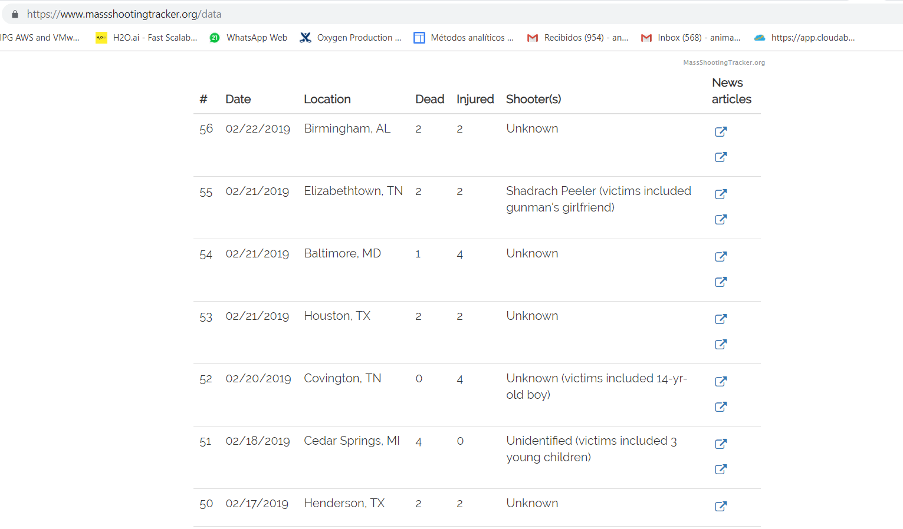
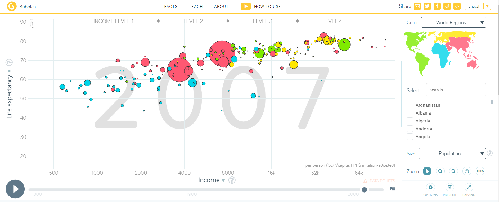
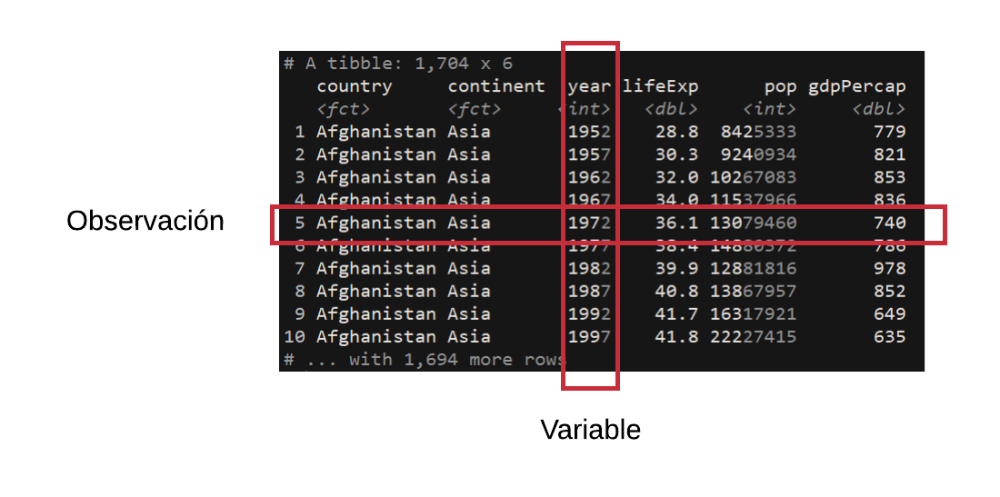

```{r setup, include=FALSE}
knitr::opts_chunk$set(echo = T, warning = F, error = F, message = F)
library(tidyverse)
library(gapminder)
```

## R-base

"R is a free software environment for statistical computing and graphics. It compiles and runs on a wide variety of UNIX platforms, Windows and MacOS."

- Fuente: https://www.r-project.org/

Esta ambiguedad viene desde S (el padre de R), John Chambers describía:

"Se define S en forma ambigua porque se quería que los usuarios pudieran *empezar en un ambiente interactivo* donde no se pensaran como programadores. A medida que sus necesidades se clarificaban y su sofisticación aumentaran, podrían *moverse hacia la programación*, donde el lenguaje y el sistema se volvían importantes."

S nace para soportar proyectos estadísticos y de análisis de datos en Bell Labs y requería:

* Flexibilidad (proyectos heterogéneos)
* Habilidad para programar

R nace en este ambiente. Ya había herramientas para hacer análsis de datos (SAS, SPSS, Stata, Minitab, Excel) pero:

* Los gráficos eran feos y no permitían tener control de los detalles.
* No se podían costumizar las herramientas.


## R

R satisface dos problemas: da flexibilidad y permite programar, dando control sobre todos los gráficos.

Además, como software libre permite implementar nuevas metodologías estadísticas y extender la funcionalidad.

Sin embargo, era más fácil hacer análisis de datos en los otros sistemas.

No fue un problema pues la mayoría de los usuarios iniciales de R ya sabían programar en lenguajes como C o Lisp. 

- Fuente: https://simplystatistics.org/2018/07/12/use-r-keynote-2018/

## R / Barreras

R continua desarrollandose como lenguaje de programación.

Al pasar el tiempo, las fortalezas de R casi lo hacen desaparecer:

1. Flexibilidad es *complejidad*.
2. Habilidad para programar requiere de *programadores*.

Muchos usuarios potenciales de R se alejaban porque:

* No estaban familiarizados con la colección de paquetes para análisis de datos,
* No habían usado S-PLUS,
* No tenían experiencia con otros lenguajes de programación,
* Eran primerizos en el análisis de datos y en estadística.

Paradójicamente, su flexibilidad y su enfoque en programación era una enorme *barrera de entrada* para los que solo querían analizar datos.

Además, había otros dos problemas clave:


## Tidyverse

"Es una colección opinionada de paquetes de R diseñados para ciencia de datos".

1. Opinionado: reduce la flexibilidad (la complejidad), adoptando ciertas decisiones.
2. Las decisiones están pensadas para funcionar bien para hacer ciencia de datos.
3. No es tan conservador pues en pos de la funcionalidad se acepta el perder compatibilidad hacia atrás.

Elimina las barreras de entrada a R para nuevos analistas:

* ggplot2 explota en popularidad porque da una forma fácil de hacer buenos gráficos.
* elimina la distancia entre la mente y la página.
* no se necesita conocer a detalle los argumentos para gráficos o funciones.
* el iniciado no tiene que tomar muchas decisiones.
* la funcionalidad se mejora con respecto al básico.
* la flexibilidad de R no se elimina, los usuarios pueden o no usarla.
* es un nuevo lenguaje encicma de uno existente.

Nuevos y viejos usuarios conviven en el tidyverse.

## Tidyverse / Datos limpios

1. Cada variable va en una columna.
2. Cada observación va en un renglón.
3. Cada unidad observacional va en una tabla.

Los datos de la Organización Mundial de la Salud http://www.who.int/tb/country/data/download/en/

Cada unidad observacional es una agregación de casos por tipos de tuberculosis, por grupos de edad, sexo y por país.

La ayuda de datos se obtiene `?who`

```{r, echo = F}
raw <- filter(who, country == "Mexico", year >= 2000, year < 2011) %>% 
  select(., country, year, contains("sp_m"))
junta <- tidyr::gather(who, key = variables, value = casos
                       , -country, -iso2, -iso3, -year, na.rm = T)
limpios <- junta %>%
  mutate(variables = gsub("new_|new", "", variables)) %>%
  tidyr::extract(., col = variables
          , into = c("diagnostico", "genero", "edad")
          , regex = "([[:alnum:]]+)_([a-z])([[0-9]]+)") 

limpios
```

Los datos originales no son **datos limpios**:

```{r, echo = F}
raw
```

En cada columna se tienen varias variables: tipo de tuberculosis, sexo y grupo de edad.

Para limpiarlos con las funciones de tidyverse, es muy sencillo.

```{r, eval = F}
filter(who, country == "Mexico", year >= 2000, year < 2011) %>% 
  select(., country, year, contains("sp_m")) %>%
  tidyr::gather(who, key = variables, value = casos
                       , -country, -iso2, -iso3, -year, na.rm = T) %>%
  mutate(variables = gsub("new_|new", "", variables)) %>%
  tidyr::extract(., col = variables
          , into = c("diagnostico", "genero", "edad")
          , regex = "([[:alnum:]]+)_([a-z])([[0-9]]+)") 
```

Para trabajar en forma más sencilla con las funciones en el *tidyverse* lo óptimo es usar **datos limpios**.

Los datos limpios tienen una *forma uniforme*.

## Tidyverse / filosofía

1. Se comparten estructuras de datos.
2. Se compone por piezas simples (legos).
3. Se basa en programación funcional.
4. El código es para humanos.

## 1. Se comparten estructuras de datos

¡Tibbles!

Funcionan mejor con listas

```{r, eval = F}
data.frame(x = list(1:2, 3:5))
```

Error in (function (..., row.names = NULL, check.rows = FALSE, check.names = TRUE,  : 
  arguments imply differing number of rows: 2, 3
  
```{r}
tibble(x = list(1:2, 3:5))
```

## 2. Se compone por piezas simples (legos)


- Fuente: https://cran.r-project.org/web/packages/magrittr/vignettes/magrittr.html

Un *pipeline* en programación consiste en un arreglo de elementos de procesamiento en donde la salida de cada elemento es la entrada del siguiente elemento. Este concepto fue concebido por Douglas Mcllroy.

En `R`, se introdujo el operador pipe en 2014, con `magrittr`. 

```{r}
library(nycflights13)

flights %>%
  mutate(
    month = str_pad(month, 2, side = "left", pad = "0")
    , day = str_pad(day, 2, side = "left", pad = "0")
    , date = lubridate::ymd(str_c(year, month, day))) %>%
  group_by(date) %>%
  summarise(n = n()) %>%
  ggplot(aes(date, n)) +
  geom_line()
```

Nota: ggplot2 es anterior al "tidyverse" y le falta consistencia **sigue usando `+`**.


Otro ejemplo: Importar y limpiar datos de matanzas con arma de fuego.



```{r, warning=F, error=F, message=F, cache=T}
library(rvest)
library(purrr)
library(readr)
library(dplyr)
library(lubridate)

df <- read_html("https://www.massshootingtracker.org/data") %>% 
  html_nodes("a[href^='https://docs.goo']") %>% 
  html_attr("href") %>% 
  map_df(read_csv) %>% 
  mutate(date=mdy(date)) -> shootings

shootings
```

- Fuente: https://rud.is/b/2016/07/26/use-quick-formula-functions-in-purrrmap-base-vs-tidtyverse-idiom-comparisonsexamples/

## 3. Se basa en programación funcional

Tiene sentido pensar en funciones cuando se repite muchas veces la misma tarea *mucho copy-paste en el codigo*

```{r}
df <- tibble::tibble(
  a = rnorm(10),
  b = rnorm(10),
  c = rnorm(10),
  d = rnorm(10)
)

df$a <- (df$a - min(df$a, na.rm = TRUE)) / 
  (max(df$a, na.rm = TRUE) - min(df$a, na.rm = TRUE))
df$b <- (df$b - min(df$b, na.rm = TRUE)) / 
  (max(df$b, na.rm = TRUE) - min(df$a, na.rm = TRUE))
df$c <- (df$c - min(df$c, na.rm = TRUE)) / 
  (max(df$c, na.rm = TRUE) - min(df$c, na.rm = TRUE))
df$d <- (df$d - min(df$d, na.rm = TRUE)) / 
  (max(df$d, na.rm = TRUE) - min(df$d, na.rm = TRUE))
df
```

Para cada columna, se reescalan los valores para que esten entre 0 y 1.

Para escribir una funcion se revisan las entradas de la misma *inputs*

```{r}
(df$a - min(df$a, na.rm = TRUE)) /
  (max(df$a, na.rm = TRUE) - min(df$a, na.rm = TRUE))
```

Reescribimos con un valor generico `x`

```{r}
x <- df$a
(x - min(x, na.rm = TRUE)) / (max(x, na.rm = TRUE) - min(x, na.rm = TRUE))
```

Se triplica el calculo del rango, simplificamos:

```{r}
rng <- range(x, na.rm = TRUE)
(x - rng[1]) / (rng[2] - rng[1])
```

Con la simplificacion, lo volvemos una funcion

```{r}
rescale01 <- function(x) {
  rng <- range(x, na.rm = TRUE)
  (x - rng[1]) / (rng[2] - rng[1])
}
rescale01(c(0, 5, 10))
```


Volvemos al problema original:

```{r}
df$a <- rescale01(df$a)
df$b <- rescale01(df$b)
df$c <- rescale01(df$c)
df$d <- rescale01(df$d)
```

Hay mucho espacio para la simplificacion.

## 4. El código es para humanos


El *pipe* permite ir leyendo, en orden (y con perspectiva funcional) los pasos en las transformaciones de los datos.

Además, los verbos permiten *leer* las acciones que se ejecutan sobre los datos.

Verbos del tidyverse:

* select
* filter
* arrange
* summarise
* mutate
* gather
* spread
* group_by
  - Transforma los verbos para que funcionen en grupos
  

## Tidyverse / filosofía en acción



- Fuente: https://www.gapminder.org/tools/#$state$time$value=2011;;&chart-type=bubbles

Para recrear el gráfico, necesitamos 5 variables

* país - punto
* continente - color
* año - filtro (slider)
* pib per capita - eje x
* esperanza de vida - eje y
* población - tamaño de la burbuja

```{r}
gapminder
```

Primero. Revisamos que tengamos datos limpios.



Filtramos para un solo año

```{r, eval = F}
gapminder %>% # despues
  filter(year == 2007) -> # crea
  gapminder07
```


```{r}
gapminder %>% # toma los datos de gapminder, despues
  filter(year == 2007) -> # filtra observaciones tomando solo 2007 y crea
  gapminder07 # nombre de nuevo dataframe
```

A graficar... Definimos el plano.

```{r}
gapminder07 %>%
  ggplot(aes(gdpPercap, lifeExp))
```

La geometría


```{r}
gapminder07 %>%
  ggplot(aes(gdpPercap, lifeExp)) +
  geom_point()
```

Incluimos escala logarítmica en eje x

```{r}
gapminder07 %>%
  ggplot(aes(gdpPercap, lifeExp)) +
  geom_point() +
  scale_x_log10()
```

Coloreamos puntos según continente:

```{r}
gapminder07 %>%
  ggplot(aes(gdpPercap, lifeExp)) +
  geom_point(aes(colour = continent)) +
  scale_x_log10()
```

El tamaño de la burbuja es la población del país:

```{r}
gapminder07 %>%
  ggplot(aes(gdpPercap, lifeExp)) +
  geom_point(aes(colour = continent, size = pop)) +
  scale_x_log10()
```

Le faltaban algunos detalles que toman bastante trabajo:

- Etiquetas en los ejes
- Espacios entre valores mostrados

```{r}
gapminder07 %>%
  ggplot(aes(gdpPercap, lifeExp)) +
  geom_point(aes(fill = continent, size = pop), shape = 21) +
  scale_x_log10(breaks = 2^(-1:7) * 1000) +
  scale_size(range = c(1, 20), guide = FALSE) +
  scale_fill_manual(
    # guide = TRUE,
    values = c(
      Africa = "#60D2E6",
      Americas = "#9AE847",
      Asia = "#EC6475",
      Europe = "#FBE84D",
      Oceania = "#0A2F51"
    )
  ) +
  labs(
    x = "Ingreso (pib per capita)"
    , y = "Esperanza de vida (años)"
  )

```

Podemos volver el gráfico una función:

```{r}
gap_plot <- function(data){
  data %>%
  ggplot(aes(gdpPercap, lifeExp)) +
  geom_point(aes(fill = continent, size = pop), shape = 21) +
  scale_x_log10(breaks = 2^(-1:7) * 1000) +
  scale_size(range = c(1, 20), guide = FALSE) +
  scale_fill_manual(
    # guide = TRUE,
    values = c(
      Africa = "#60D2E6",
      Americas = "#9AE847",
      Asia = "#EC6475",
      Europe = "#FBE84D",
      Oceania = "#0A2F51"
    )
  ) +
  labs(
    x = "Ingreso (pib per capita)"
    , y = "Esperanza de vida (años)"
  )
}
```

Y se puede utilizar para distintos filtros de los mismos datos:

```{r}
gapminder %>%
  filter(country == "Mexico") %>%
  gap_plot()
```


```{r}
gapminder %>%
  filter(year == 1952) %>%
  gap_plot()
```

```{r}
gapminder %>%
  filter(year == 1987) %>%
  gap_plot()
```

```{r}
gapminder %>%
  filter(year == 2007) %>%
  gap_plot()
```

## Instalación

```{r, eval = F}
install.packages("tidyverse")
library(tidyverse)
```

